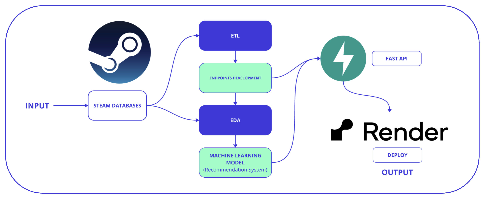

# <h1 align=left> MACHINE LEARNING OPERATIONS (MLOps) </h1>
# <h3 align=left>**`PAULA DAHER`**</h3>

# <h3 align=left>**`DESCRIPCIÓN DEL PROYECTO`**</h3>

En este proyecto atravesaremos todas las etapas del ciclo de vida de un proyecto de Machine Learning, obteniendo como resultado final un desarrollo de una api deployada en render a traves de la cual se pueden hacer consultas a los registros de una base de datos de la plataforma Steam. 
Además, se realiza el desarrollo de un modelo de machine learning de recomendación de videos juegos por similitud del coseno, al cual podemos acceder también a través de la api. 

### El proyecto se divide en dos partes:

**Parte I:** Data Engineering
Se empieza desde cero, haciendo un trabajo rápido de Data Engineer con la recolección y extracción de datos de archivos, así como sus tratamiento, transformación y modelado. 

**Parte II:** Machine Learning
Se crea el modelo, se consumen los datos ya limpios, y se entrenar bajo ciertas condiciones. Como resultado se crea un sistema de recomendación de videojuegos para usuarios de Steam, utilizando técnicas de MLOps para asegurar que el modelo y la API sean escalables, reproducibles y mantenibles.

# <h3 align=left>**`OBJETIVOS`**</h3>

**Transformaciones de Datos:** Leer y limpiar el dataset, eliminando columnas innecesarias para optimizar el rendimiento sabiendo que la madurez de los datos es poca: Datos anidados, de tipo raw, no hay procesos automatizados para la actualización de nuevos productos, entre otras cosas.   
[Link de descarga de Datasets sobre los que se les aplicó el ETL](https://drive.google.com/drive/folders/1HqBG2-sUkz_R3h1dZU5F2uAzpRn7BSpj)  
[Diccionario de datos](https://docs.google.com/spreadsheets/d/1-t9HLzLHIGXvliq56UE_gMaWBVTPfrlTf2D9uAtLGrk/edit#gid=0)

**Feature Engineering:** Realizar análisis de sentimiento en las reseñas de usuarios y crear una nueva columna 'sentiment_analysis'. 

**Desarrollo de API:** Implementar una API con FastAPI que permita consultar datos y recomendaciones. 

**Despliegue:** Desplegar la API en un servicio web para que sea accesible públicamente. 

**Análisis Exploratorio de Datos (EDA):** Explorar y visualizar los datos para obtener insights valiosos.
[Artículo de interés](https://medium.com/swlh/introduction-to-exploratory-data-analysis-eda-d83424e47151)

**Modelo de Aprendizaje Automático:**   
Desarrollar un sistema de recomendación basado en la similitud del coseno.

# <h3 align=left>**`ESTRUCTURA DEL PROYECTO`**</h3>
- **Data:.parquet** En el repositorio te encontraras con 5 archivos parquet, resultados del ETL, en base a los cuales funcionan las funciones de consulta y modelado.
- **Notebooks:** Jupyter notebooks para ETL y para EDA.
- **main.py:** Archivo principal de la API (consultas y modelo de recomendación).
- **requirements.txt:** Lista de dependencias del proyecto.
- **README.md:** Descripción y guía del proyecto.

# <h3 align=left>**`PASOS REALIZADOS`**</h3>
1. Transformaciones de Datos:  
Se realizó la lectura de los dataset en el formato correcto, se realiza la limpieza y preprocesamiento de los datos de las tres bases sobre las cuales se trabajó. 
Se eliminaron columnas innecesarias, se manejaron valores nulos y datos anidados entre otras cosas.   
Las transformaciones se encuentran asentadas en los notebooks [etl_steam](https://github.com/PaulaDaher/Proyecto_MLOps_STEAM/blob/main/EDA_steam.ipynb), [etl_user_items](https://github.com/PaulaDaher/Proyecto_MLOps_STEAM/blob/main/ETL_user_items.ipynb) y [etl_user_reviews](https://github.com/PaulaDaher/Proyecto_MLOps_STEAM/blob/main/ETL_user_reviews.ipynb)

2. Feature Engineering:   
Se aplicó análisis de sentimiento en las reseñas de usuarios:
Se creó la columna 'sentiment_analysis' con valores 0 (negativo), 1 (neutral) y 2 (positivo) a traves de la librería NLTK: Análisis de sentimiento.
Se asignó un valor de 1 a las reseñas ausentes.

3. Desarrollo de API:  
Se implementaron los siguientes endpoints en la API utilizando FastAPI:
 - **developer(desarrollador: str):** Cantidad de items y porcentaje de contenido Free por año según empresa desarrolladora.
 - **userdata(User_id: str):** Cantidad de dinero gastado por el usuario, porcentaje de recomendación y cantidad de items.
 - **UserForGenre(genero: str):** Usuario con más horas jugadas para el género dado y acumulación de horas jugadas por año de lanzamiento.
 - **best_developer_year(año: int):** Top 3 de desarrolladores con juegos más recomendados por usuarios para el año dado.
 - **developer_reviews_analysis(desarrolladora: str):** Análisis de reseñas de usuarios categorizados con análisis de sentimiento (positivo o negativo).
 - **recomendacion_juego(id de producto: str):** Lista de 5 juegos recomendados similares al ingresado.

4. Despliegue:  
La API se desplegó utilizando Render para que sea accesible públicamente desde cualquier dispositivo conectado a Internet.

5. Análisis Exploratorio de Datos (EDA):  
Se realizó un análisis exploratorio de los datos para entender mejor las relaciones entre las variables, detectar outliers y patrones interesantes.

6. Modelo de Aprendizaje Automático:  
Se desarrolló un sistema de recomendación basado en la similitud del coseno:
 - Input: ID de un producto.
 - Output: Lista de 5 juegos recomendados similares al ingresado.

7. Video de Demostración:  
Se creó un video demostrando el funcionamiento de las consultas de la API y el modelo de ML entrenado. El video muestra cómo se realizan las consultas y explica brevemente el despliegue del proyecto.

# <h3 align=left>**`TECNOLOGÍA UTILIZADA`**</h3>
- Python: Lenguaje de programación principal.
- FastAPI: Framework para el desarrollo de la API.
- Pandas: Manipulación y análisis de datos.
- Scikit-learn: Desarrollo del modelo de recomendación.
- NLTK: Análisis de sentimiento.
- Render: Despliegue de la API.

# <h3 align=left>**`API Y VIDEO`**</h3>
### Para más detalles, puedes consultar el código y los notebooks en este repositorio. Además, puedes acceder a la API y ver el video de demostración aquí:
### [Acceder a la API](https://proyecto-mlops-steam-4gux.onrender.com)
### Ver video 

